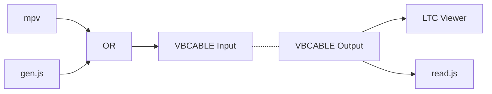

# JSLTC

Demo to read live ltc audio with js

NOTE: just a POC to test that it works

I am using VB-Cable to help route the audio. <https://vb-audio.com/Cable/>  
I am using piXtimecode to verify LTC. <https://apps.microsoft.com/detail/9MT05F4N77XZ>  
Generate LTC from <https://elteesee.pehrhovey.net/>  



have mpv play audio to specific device

```ps1
mpv.com --audio-device='wasapi/{519e9287-141e-48ff-8422-338c3dbdbb7d}' .\LTC_01000000_10mins_25fps_48000x16.wav
```

list devices for mpv

```ps1
mpv.com --audio-device=help

List of detected audio devices:
  'auto' (Autoselect device)
  'wasapi/{519e9287-141e-48ff-8422-338c3dbdbb7d}' (CABLE Input (VB-Audio Virtual Cable)) Audio))
  'openal' (Default (openal))
  'sdl' (Default (sdl))

```

To get deviceId run list_dev.js

Big help from <https://github.com/philhartung/aes67-sender>
and <https://github.com/philhartung/aes67-monitor> on how to get audio working.


works with node v14.15.4 and windows.

Using WINDOWS_WASAPI as backend. Default is WINDOWS_ASIO but every run cuts out the audio. It only sees some interfaces and not all.
